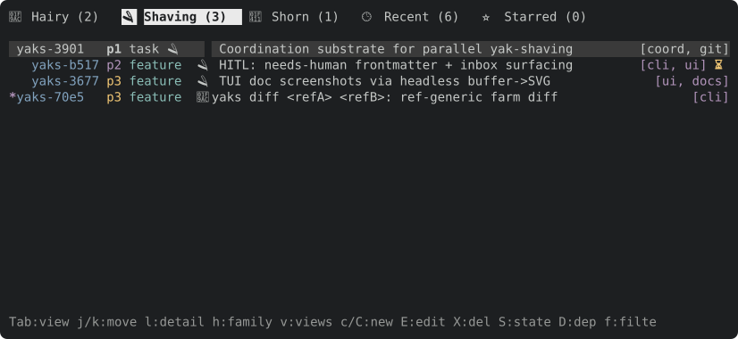
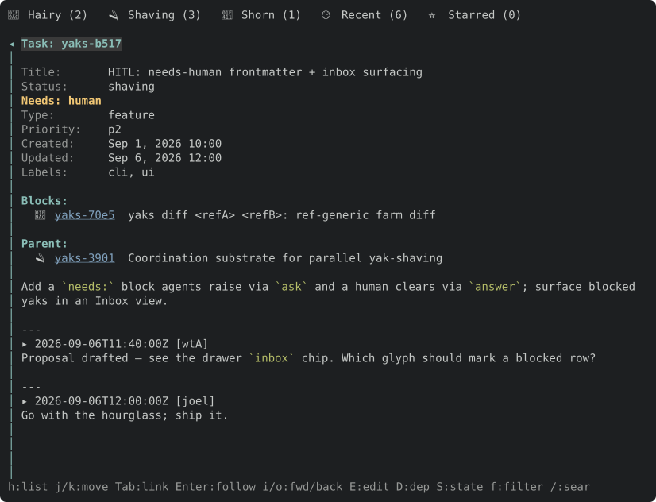
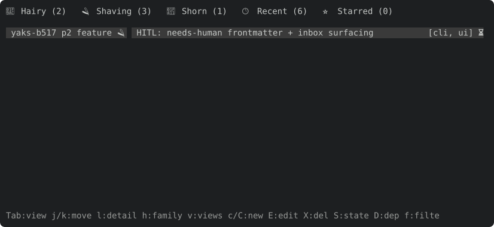
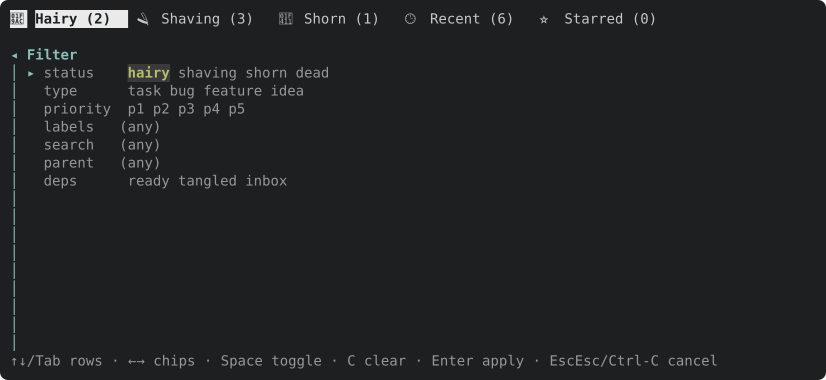

# TUI guide

`yaks tui` opens an interactive terminal UI over the same herd the CLI operates
on. Every mutation writes the same `.yaks/` files, so the TUI and CLI are
interchangeable.

## Layout

- **List pane** — the yaks in the active *view*, as a tree or flat list.
  Views are tabs across the top (`Tab`/`[`/`]` to switch). Built-in views
  include the default tree, **Recent**, **Inbox** (yaks awaiting a human), and
  **Starred**; you can save the current filter as a named view.
- **Detail pane** — the selected yak: fields, parent/deps/children, source, a
  `Needs:` line when blocked, and the body + timestamped notes. Task-id
  references and URLs in the body are followable links.
- **Filter drawer** (`f`) — toggle status / type / priority chips, a label and
  search box, a parent scope, and `ready` / `tangled` / `inbox` predicates. The
  drawer composes into any view.
- **Status bar** — the active herd, view, and cursor context.

## Signals

- A **`⏳` badge** on a row marks a yak with a `needs` block (awaiting a human);
  the detail `Needs:` line renders in a warning accent.
- The dependency-blocked marker (`*`) and the multi-select marker (`●`) are
  distinct axes and can co-occur.

## Keys

**Movement** — `j`/`k` or `↓`/`↑` move; `d`/`u` half-page; `PgDn`/`PgUp`
full-page; `g`/`G` top/bottom.

**List pane**

| Key | Action |
|---|---|
| `Tab` / `S-Tab`, `[` / `]` | Next / previous view |
| `l` / `→` / `Enter` | Show detail pane |
| `Space` | Collapse / expand subtree |
| `m` | Mark / unmark row (multi-select) |
| `S` (with marks) | Bulk state transition over the marked set |
| `v` / `V` | View picker / save filter as a view |
| `*` | Star / unstar (Starred view) |

**Detail pane** — `h`/`←`/`Esc` back; `j`/`k` scroll; `Tab`/`[`/`]` cycle links,
`Enter` follow; `i`/`o` nav forward/back; `J`/`K` next/prev task; `Ctrl-N`/`Ctrl-P`
next/prev content block; `v` + `Shift-↑↓` visual-select lines, `y` copy;
`/`, `n`/`N` find.

**Edit**

| Key | Action |
|---|---|
| `c` / `C` | New root / child yak |
| `E` | Edit the field/description/comment at the cursor |
| `P` / `T` / `L` / `S` | Priority / type / labels / state |
| `D` / `R` | Add dependency / reparent |
| `M` | Add a comment (note) |
| `a` | Ask / answer (raise or clear a `needs` block) |
| `A` / `O` | Attach artifact / open it |
| `X` | Slaughter (delete, with confirm) |
| `:w` / `:q` / `:wq` | Save / cancel / save+close (editor Normal mode) |

**Search & filter** — `/` inline search; `f` filter drawer; `Esc` revert filter
to the active view.

**General** — `y` copy yak id; `?` toggle help; `q` / `Ctrl-C` quit.

**List pane** — the tree of a view (here the *Shaving* tab): ids, priorities,
types, status glyphs, titles, and dim labels. The `*` gutter marks a
dependency-blocked yak; the `⏳` marks one awaiting a human.



**Detail pane** — the selected yak. `Needs:` renders in a warning accent above
the fields; `Blocks:`/`Parent:` list linked yaks; the body carries the
description and timestamped, attributed notes (here a `[wtA]` → `[joel]`
human-in-the-loop exchange).



**Inbox** — the flat, cross-status list of every yak carrying a `needs` block.
It is unpinned (no tab); reach it from the view picker (`v`) or the drawer
`inbox` chip.



**Filter drawer** (`f`) — status / type / priority chips plus label, search,
parent, and `ready`/`tangled`/`inbox` predicates. It composes into any view.



# Screenshots

These are generated headlessly: the [`toque`](../crates/toque/README.md) crate
drives the TUI into an in-memory ratatui buffer and renders it to a self-contained
color SVG (`toque::render_to_svg`). They are deterministic and regenerate with the
UI (no live-terminal capture), via:

```sh
cargo test -p yaks docshots -- --ignored   # writes docs/assets/*.svg
```
